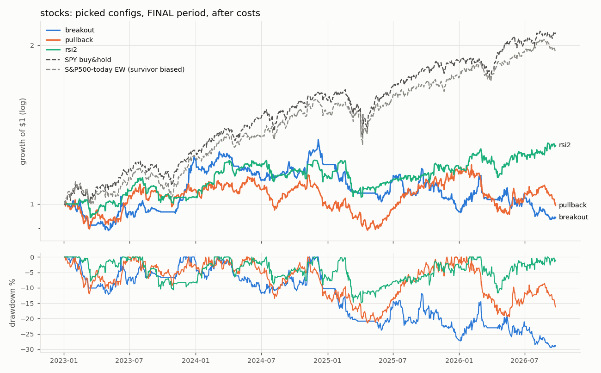
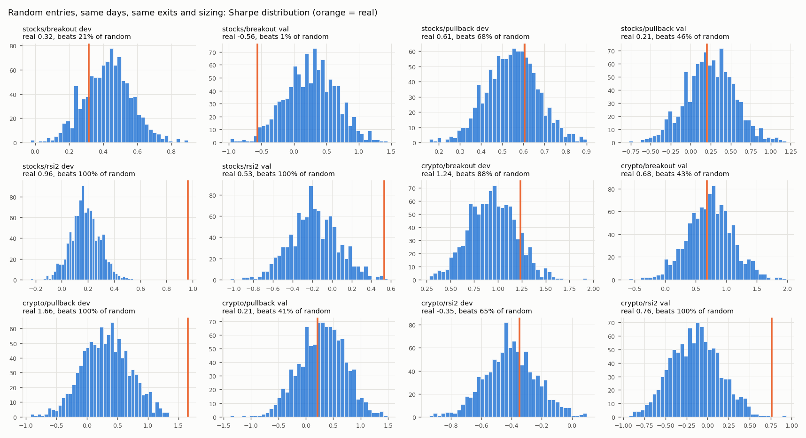

# Can Rule-Based Swing Trading Beat Buy-and-Hold?

I tested whether popular price action swing trading setups, plus the "human" filters discretionary traders use, can beat simply buying and holding the market. I ran it on 30 years of stocks, forex, and crypto, out of sample and after costs.

**Short answer: no.** In the untouched final period (2023 to Sep 2026), the best stock strategy had a Sharpe of 0.64 vs 1.43 for SPY. The best crypto strategy had 0.16 vs 1.16 for BTC. Forex never got meaningfully above zero.

Full write-up: **[swing/results/SUMMARY.md](swing/results/SUMMARY.md)**

## What I tested

- **3 entry setups:** 20-day base breakouts (Minervini / Qullamaggie style), trend pullbacks (Raschke Holy Grail), and Connors RSI(2) dip-buying
- **"Human" filter layers, each as an on/off toggle:** market regime, volatility stand-down, chop filter, relative strength, a 0-100 setup quality score, volume confirmation, earnings-gap proxy, position sizing and heat caps, and several exit styles
- **350 strategy variants** across S&P 500 stocks, 28 G10 forex pairs, and Binance crypto
- **Realistic simulation:** shared portfolio equity, next-day-open fills, gaps through stops filled at the open, and per-trade costs (stocks 10 bps, forex 2 bps, crypto 20 bps)

## How I tried not to fool myself

- **Walk-forward periods.** Develop on data through 2019, validate on 2020 to 2022, then run the final 2023+ period **once**. A lock file records when it ran.
- **Pre-registered hypothesis.** Before the final run I wrote down the one config I expected to work (stocks RSI(2) + relative strength + quality score) and the bar it had to clear. It failed: Sharpe 0.56 vs 1.43, and it beat only 86.6% of random-entry runs (needed 95%).
- **1,000 random-entry simulations** per strategy, same exits and sizing, to separate skill from luck.
- **Multiple-testing haircut** (Harvey-Liu BHY) on dev Sharpe ratios, since trying 350 variants guarantees some look good by chance.
- **Disclosed mistakes.** A bug in the quality-score gate was found after validation. It was fixed, the picks were not changed, and the pre-fix output is kept in `results/`.

## Key results (final period, 2023 to Sep 2026)

| | Sharpe | CAGR | Max drawdown |
|---|---|---|---|
| **SPY buy & hold** | **1.43** | 22.4% | -18.8% |
| Best stock config (RSI(2), all layers) | 0.64 | 4.3% | -15.5% |
| **BTC buy & hold** | **1.16** | 54.4% | -53.0% |
| Best crypto config (pullback, naive) | 0.16 | -0.5% | -51.2% |
| Best forex config | 0.22 | 0.9% | -8.2% |




## What I learned

- **Stacking filters makes losing systems lose less, not win.** All layers together beat the naive rule in 13 of 18 out-of-sample comparisons, mostly by trading 4 to 5x less.
- **Picking what worked in development didn't carry forward.** A layer's effect in development had a rank correlation of -0.07 with its effect in validation.
- **The only signal with real evidence (stocks RSI(2)) faded** from beating 99.9% of random entries in development to 86.6% in the final period, and survivorship bias in the stock universe likely inflated it.
- **A lot of discretionary skill can't be coded:** catalysts and news, sector themes, reading a chart, and intraday execution.

## Run it

```bash
pip install -r requirements.txt
python3 download_market_data.py --tf 1d      # free daily data into data/ (not included in this repo)
python3 trim_small_files.py
python3 swing/run.py data                    # clean + cache
python3 swing/run.py baseline                # then: layers, ablation, robust
python3 swing/selftest.py                    # engine sanity checks
```

The final period is locked and will refuse to run a second time. See [swing/README.md](swing/README.md) for the full layout and data cleaning notes.

## Tools

Python, pandas, NumPy, SciPy, matplotlib, yfinance, Binance public data
